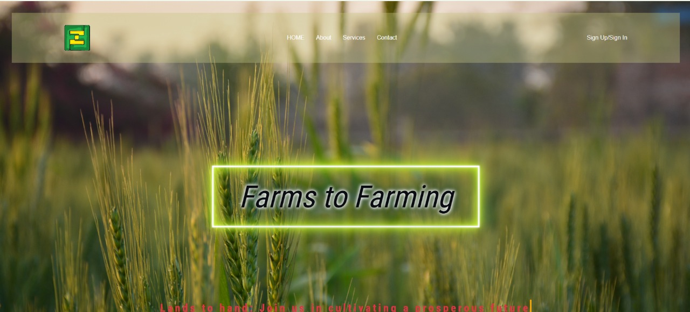
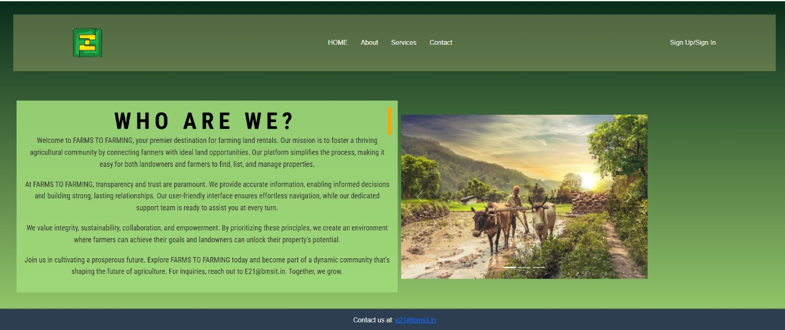
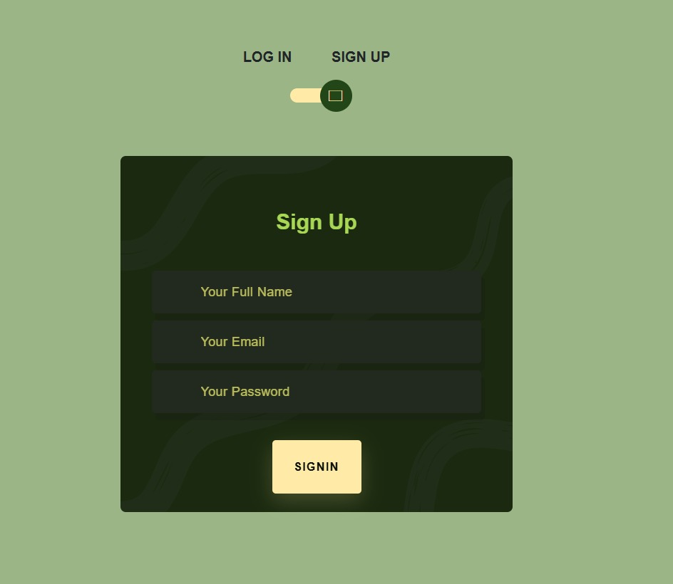
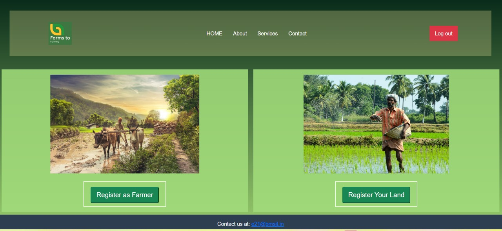
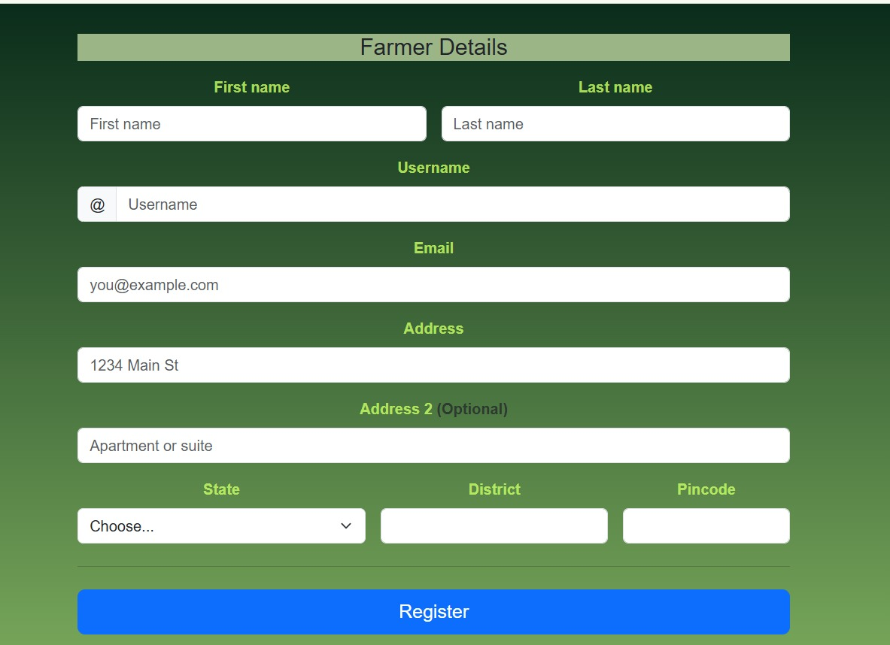
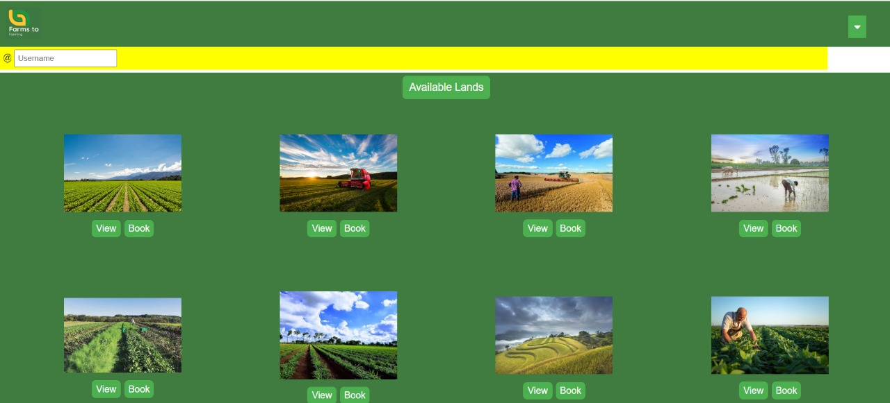
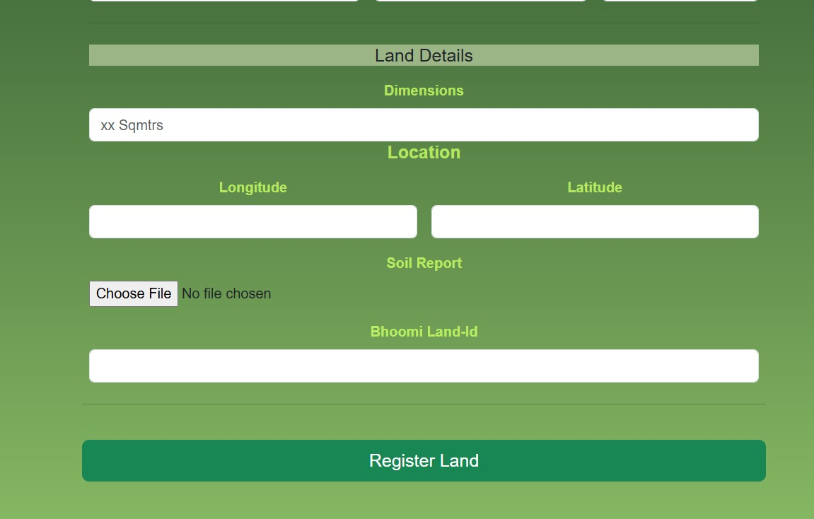

# 🌾 Farm_To_Farming

**Farm_To_Farming** is a Laravel-based web platform that connects landowners with unused land to farmers willing to relocate. Contracts ensure profit sharing, while experts and ML models help determine the best crops using soil data and 1–3 year climate forecasts.

---

## 🚀 Features

- Matchmaking between landowners and farmers  
- Digital contract generation with profit-sharing terms  
- Expert & ML-based crop recommendations  
- Soil, wind, and climate analysis for 1–3 years  
- Dashboard for crop prediction and performance

---

## 🛠️ Tech Stack

- **Backend:** PHP (Laravel Framework)  
- **Frontend:** Blade, HTML/CSS, Bootstrap  
- **Database:** MySQL  
- **ML Integration:** Python (via API) or external service  
- **APIs:** OpenWeather, Google Maps (optional)

---

## 🖼️ Demo Screens

### 🔍 Landowner & Farmer Matching  


### 📄 Contract Agreement Interface  


### 📈 Crop Recommendation Dashboard  


### 🌱 Soil & Climate Analysis  









---

## ⚙️ Installation

```bash
git clone https://github.com/your-username/Farm_To_Farming.git
cd Farm_To_Farming
composer install
cp .env.example .env
php artisan key:generate
php artisan migrate
php artisan serve
